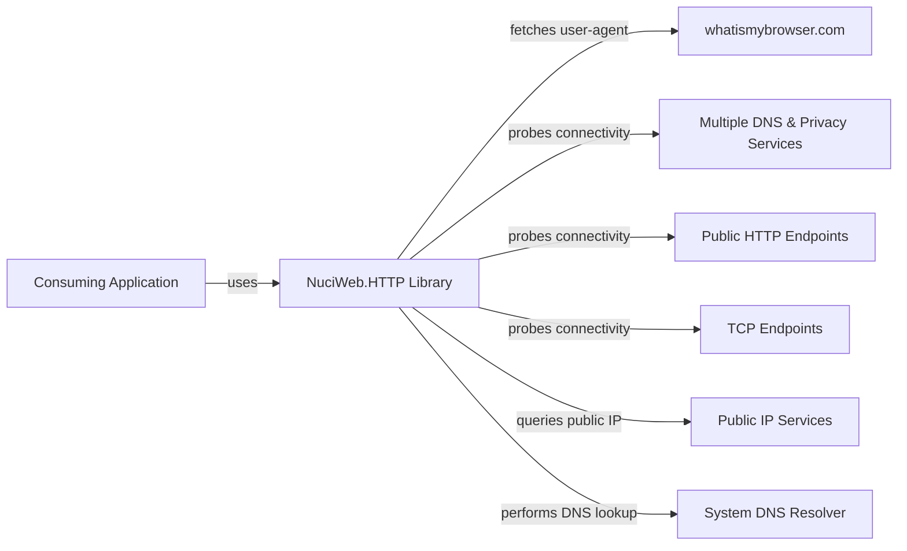
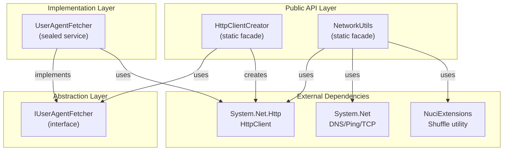
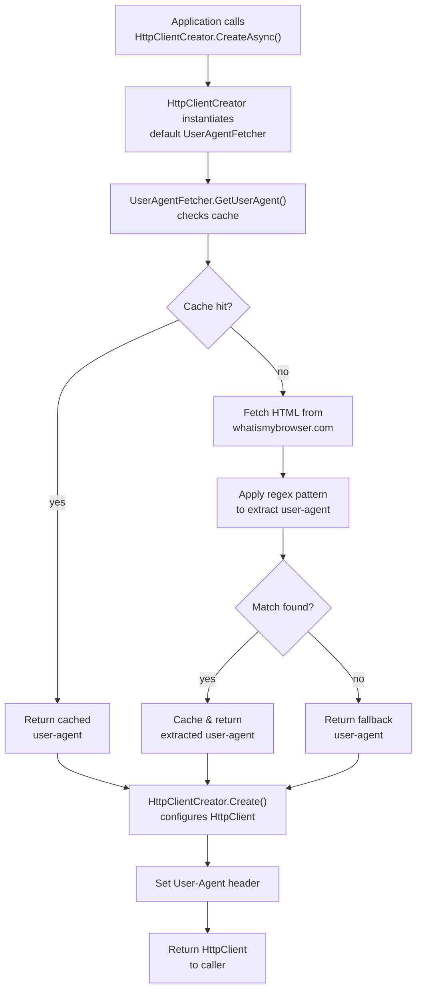
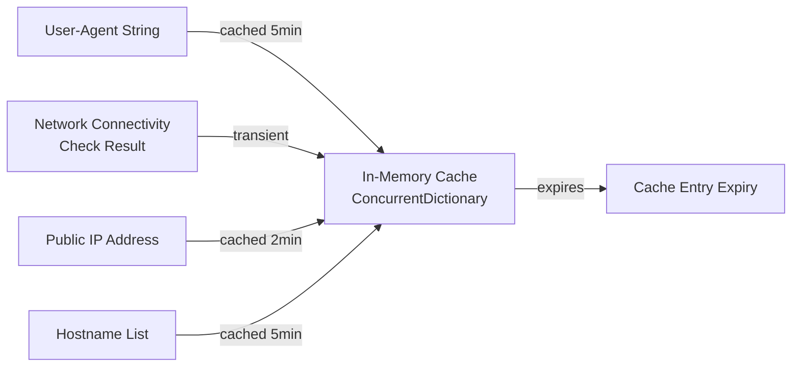

# NuciWeb.HTTP Architecture

This document describes the current architecture of NuciWeb.HTTP, a lightweight .NET library providing utilities for HTTP communication and network operations.

## 📑 Table of Contents

- [Purpose](#-purpose)
- [System Context](#-system-context)
- [Architectural Style](#-architectural-style)
- [Runtime Flow](#-runtime-flow)
- [Components](#-components)
- [Data Architecture](#-data-architecture)
- [Interfaces and Integrations](#-interfaces-and-integrations)
- [Cross-Cutting Concerns](#-cross-cutting-concerns)
- [Dependency Direction and Rules](#-dependency-direction-and-rules)
- [External Dependencies](#-external-dependencies)
- [Deployment and Operations](#-deployment-and-operations)
- [Testing and Verification](#-testing-and-verification)

## 🎯 Purpose

NuciWeb.HTTP is a utility library for .NET applications that simplifies common HTTP and network-related operations. The library provides abstractions and helper methods for:

- Creating `HttpClient` instances with realistic User-Agent headers
- Detecting internet connectivity using multiple probing strategies
- Retrieving public IP addresses through fallback providers
- Performing reverse DNS lookups to resolve hostnames

This library is consumed by other applications as a NuGet package and targets .NET 10.0. The audience comprises .NET developers requiring HTTP communication utilities without implementing these capabilities from scratch.

## 🌐 System Context



The principal external boundaries are:

- **Web Data Source (whatismybrowser.com):** `UserAgentFetcher` retrieves the latest Firefox User-Agent string via HTTP to maintain realistic browser identification.
- **Connectivity Probe Services:** Multiple privacy-focused DNS providers, community services, and HTTPS endpoints are used to verify internet connectivity through ping, TCP, and HTTP probes.
- **Public IP Providers:** A curated list of public IP discovery services (e.g., `ident.me`, `ifconfig.co`, `ipify.org`) with fallback semantics to retrieve the system's public IP address.
- **System DNS Resolver:** Bidirectional integration with the operating system's DNS resolver for reverse hostname lookups via `System.Net.Dns`.

## 🏗️ Architectural Style

NuciWeb.HTTP follows a **utility library** architectural style, organised as a collection of cohesive static facades and a single stateful service. The design emphasises simplicity, composability, and pragmatic use of proven libraries from the .NET framework.



The principal architecture boundaries are:

- **Public API (Static Facades):** `HttpClientCreator` and `NetworkUtils` expose all functionality through static methods, permitting direct library use without explicit dependency injection.
- **Abstraction Boundary:** `IUserAgentFetcher` decouples the concrete user-agent fetching implementation from `HttpClientCreator`, enabling test mocking and runtime substitution.
- **Implementation Boundary:** `UserAgentFetcher` implements the abstraction with state management (caching) and web scraping logic.
- **External Service Boundary:** Direct dependency on .NET Framework classes (`HttpClient`, `Dns`, `Ping`) and `NuciExtensions` for collection shuffling.

## 🔄 Runtime Flow

### Startup and Initialisation



The principal runtime sequence for Internet connectivity detection is:

1. Application invokes `NetworkUtils.HasInternetAccessAsync()`
2. Method initialises cancellation token and creates three concurrent probe tasks: TCP, HTTP, and Ping
3. Each probe strategy independently tests connectivity against a shuffled list of fallback hosts
4. First successful probe triggers cancellation of remaining probes and returns `true`
5. If all probes exhaust their hosts without success, method returns `false`

### Public IP Retrieval

1. Application calls `NetworkUtils.GetPublicIpAddress()`
2. Cache is checked; if valid and non-expired (2 minutes), cached value is returned
3. If no cache or expired, `RetrievePublicIpAddress()` is invoked
4. Method verifies internet access; throws if unavailable
5. Iterates through a shuffled list of public IP service URLs
6. Normalises HTTP response (whitespace, validation, IPv4 filter)
7. Returns first valid public IPv4 address; on failure, throws `InvalidOperationException` with aggregated errors

## 🧩 Components

| Component | Responsibility | Principal Dependencies | Lifetime or Ownership |
|-----------|----------------|------------------------|-----------------------|
| `HttpClientCreator` | Static facade for creating configured `HttpClient` instances; abstracts user-agent acquisition | `IUserAgentFetcher`, `System.Net.Http.HttpClient` | Static; stateless |
| `IUserAgentFetcher` | Public contract for user-agent string retrieval; enables polymorphism and testability | None; public abstraction | Owned by implementations |
| `UserAgentFetcher` | Implements user-agent fetching via web scraping with local caching; sealed to prevent inheritance | `System.Net.Http.HttpClient`, `System.Text.RegularExpressions.Regex` | Instance; stateful cache |
| `NetworkUtils` | Static facade providing internet connectivity checks, IP address discovery, and reverse DNS resolution | `System.Net.Http.HttpClient`, `System.Net.NetworkInformation`, `System.Net.Sockets.Dns`, `NuciExtensions` | Static; manages shared `HttpClient` and concurrent cache |

## 💾 Data Architecture



| Data or Store | Owner | Representation and Storage | Lifecycle or Consistency |
|---------------|-------|----------------------------|--------------------------|
| `User-Agent String` | `UserAgentFetcher` | `string`; extracted via regex from remote HTML; cached in `ConcurrentDictionary<string, CacheEntry>` | Cached for 5 minutes from first successful retrieval; invalidated on expiry or process termination |
| `Public IP Address` | `NetworkUtils` | `string` (IPv4 only); normalised from HTTP response bodies; cached in `ConcurrentDictionary<string, CacheEntry>` | Cached for 2 minutes from first successful retrieval; multiple HTTP calls made to fallback providers until valid address found |
| `Reverse Hostname List` | `NetworkUtils` | `string[]` (hostname and aliases); result of system DNS lookup; cached in `ConcurrentDictionary<string, CacheEntry>` | Cached for 5 minutes per IP address; empty list returned if reverse lookup fails |
| `Cache` | `NetworkUtils` | `ConcurrentDictionary<string, CacheEntry>` where `CacheEntry` is a sealed record with `object Value` and `DateTimeOffset ExpiresAt` | Thread-safe; entries expire independently; no active cleanup; expired entries detected on lookup |

## 🔌 Interfaces and Integrations

| Interface or Integration | Direction | Contract | Owner | Failure Semantics |
|--------------------------|-----------|----------|-------|-------------------|
| `whatismybrowser.com` | Outbound | HTTPS GET; retrieves HTML page; regex extraction of Firefox user-agent pattern | `UserAgentFetcher` | Falls back to hardcoded fallback user-agent; caches on success; no retry on HTTP failure |
| `Public IP Services` | Outbound | HTTPS GET; returns plain-text IPv4 address (e.g., `203.0.113.5`); normalization and validation applied | `NetworkUtils` | Attempts each service in shuffled order; continues to next on HTTP failure, timeout, or invalid response; throws `InvalidOperationException` if all sources exhausted |
| `Connectivity Probes (Ping)` | Outbound | ICMP Echo; tests against 50+ privacy-focused and community services; 2-second timeout per host | `NetworkUtils` | Continues to next host on timeout or error; first success terminates other probes; returns `false` if all hosts fail |
| `Connectivity Probes (TCP)` | Outbound | TCP SYN to HTTPS port (443); tests against 50+ services; 2-second timeout per host | `NetworkUtils` | Continues to next host on timeout or error; first success terminates other probes; returns `false` if all hosts fail |
| `Connectivity Probes (HTTP)` | Outbound | HTTPS GET with 3-second timeout; tests against 30+ services with HEAD-like semantics | `NetworkUtils` | Continues to next URL on timeout or error; first success (2xx/3xx) terminates other probes; returns `false` if all URLs fail |
| `System DNS Resolver` | Outbound | `Dns.GetHostEntry(IPAddress)` synchronous call; reverse hostname lookup | `NetworkUtils` | Returns empty list on `SocketException`; no DNS query timeout configuration (uses OS defaults) |

## 🧵 Cross-Cutting Concerns

### Concurrency and Resource Use

`NetworkUtils` implements a **race-to-success** pattern for connectivity detection:

- Three concurrent probe tasks (Ping, TCP, HTTP) are launched simultaneously via `Task.WhenAny()`
- First successful probe triggers `CancellationToken.Cancel()` to terminate remaining tasks
- Shared static `HttpClient` is reused across all calls; thread-safe for concurrent requests
- `ConcurrentDictionary<string, CacheEntry>` protects cache from race conditions; expiry checks are atomic reads
- Public IP retrieval shuffles service URLs to distribute load; no backpressure mechanism
- Reverse DNS lookups are blocking on the calling thread; caching mitigates repeated resolutions

**Resource Limits:**

- Shared `HttpClient` has no explicit connection pool limits; relies on .NET Framework defaults (typically 10 connections per host)
- Cache size is unbounded; entries expire independently but are never pruned
- Probe attempts use bounded timeouts (2–3 seconds) to prevent indefinite hangs
- No explicit thread limits; concurrency delegated to `Task.WhenAny()` and thread pool

### Security and Privacy

- User-Agent string is fetched from a remote source to maintain realism; cached to reduce external calls
- No authentication or secrets are embedded in source or configuration
- Public IP retrieval uses a curated list of privacy-respecting services (Mullvad, Infomaniak, Quad9, Proton, EFF, FSF, etc.)
- Fallback user-agent is hardcoded for resilience when external source is unavailable
- Input validation: regex patterns enforce Firefox user-agent format; IP addresses validated with `IPAddress.TryParse()`
- HTTP responses are trimmed and normalised before use; untrusted input from remote sources is validated before parsing

### Error Handling

- `HttpClientCreator.CreateAsync(IUserAgentFetcher)` propagates exceptions from the fetcher; no retry or fallback
- `UserAgentFetcher.GetUserAgent()` silently falls back to hardcoded user-agent if remote fetch fails or regex finds no match
- `NetworkUtils.HasInternetAccessAsync()` returns `false` if all probes fail; does not throw
- `NetworkUtils.GetPublicIpAddress()` throws `InvalidOperationException` with aggregated errors if all IP sources fail; throws `InvalidOperationException` if no internet access detected
- `NetworkUtils.GetHostnames()` returns empty `List<string>` if reverse DNS lookup fails; validates IP address format upfront
- `NetworkUtils.WaitForInternetAccess()` throws `TimeoutException` if connectivity is not available within the specified duration

### Observability

No logging, metrics, or tracing are implemented. Consumers must rely on exception messages and return values to diagnose failures:

- Failed user-agent fetches are silent (logged only via fallback behaviour)
- Connectivity check failures are reported as boolean results; no diagnostic output
- Public IP retrieval failures include aggregated inner exceptions for debugging
- DNS lookup failures are silently returned as empty lists

## 🧭 Dependency Direction and Rules

```mermaid
graph TD
    Consumer["Consuming Application"]
    HC["HttpClientCreator<br/>(static facade)"]
    NU["NetworkUtils<br/>(static facade)"]
    IUF["IUserAgentFetcher<br/>(abstraction)"]
    UAF["UserAgentFetcher<br/>(implementation)"]
    NuciExt["NuciExtensions<br/>(external lib)"]
    NetHttp["System.Net.Http"]
    NetCore["System.Net<br/>System.Net.Sockets<br/>System.Net.NetworkInformation"]

    Consumer -->|calls| HC
    Consumer -->|calls| NU
    Consumer -->|optionally injects| IUF
    HC -->|depends on| IUF
    HC -->|uses| NetHttp
    IUF -->|defines contract|  UAF
    UAF -->|uses| NetHttp
    NU -->|uses| NetHttp
    NU -->|uses| NetCore
    NU -->|uses| NuciExt

    style HC fill:#e1f5ff
    style NU fill:#e1f5ff
    style IUF fill:#f3e5f5
    style UAF fill:#fff3e0
```

The principal dependency rules are:

- **Acyclic Dependency Graph:** No circular dependencies exist; all dependencies flow inbound to the library from external .NET Framework packages
- **Inversion of Control at Boundary:** `IUserAgentFetcher` is injected to support testing; `HttpClientCreator` provides default implementation
- **Static Facades as Stable Entry Points:** `HttpClientCreator` and `NetworkUtils` expose all public functionality; application code depends only on these facades and the `IUserAgentFetcher` interface
- **Sealed Implementation:** `UserAgentFetcher` is sealed to signal that inheritance is not supported; state management is internal
- **No Cross-Component Dependencies:** Components do not depend on each other; each is independently usable
- **Stateless vs. Stateful Separation:** Static facades are stateless; state is confined to `UserAgentFetcher` and `NetworkUtils` static cache

## 📦 External Dependencies

| Dependency | Responsibility | Integration Boundary | Architectural Consequence |
|------------|----------------|----------------------|---------------------------|
| `System.Net.Http` (HttpClient) | HTTP communication for user-agent fetching and public IP retrieval | Instantiated directly by `HttpClientCreator` and `NetworkUtils` | Tight coupling to .NET's HTTP stack; shared static instance in `NetworkUtils` creates a single point of contention and cache |
| `System.Net` (IPAddress, Dns) | IP address validation and reverse DNS lookups | Direct `static` method calls; exception handling for `SocketException` | No abstraction layer; test mocking requires reflection or helper methods |
| `System.Net.NetworkInformation` (Ping) | ICMP connectivity probing | Direct `Ping` class instantiation with timeout configuration | Synchronous API wrapped with `async` state machine; timeout granularity is per-host (2 seconds) |
| `System.Net.Sockets` (TcpClient) | TCP connectivity probing | Direct instantiation with connection timeout | Synchronous connection attempt; no built-in keep-alive or partial failures |
| `System.Text.RegularExpressions` (Regex) | User-agent pattern matching | Pattern compiled inline on each call (no caching) | Regex is compiled and executed repeatedly; pattern string is private static |
| `NuciExtensions` (v5.3.1) | Collection shuffling utility (`.Shuffle()`) | Extension method called on `List<string>` | Adds external dependency; simplifies randomisation without reimplementation |

## 🚀 Deployment and Operations

| Concern | Current Design | Architectural Consequence |
|---------|----------------|---------------------------|
| **Package Model** | NuGet package targeting .NET 10.0; no application host or service topology | Library is embedded; no separate deployment unit; versioning via semantic versioning |
| **Persistent State** | None; in-memory cache cleared on process exit | Transient caching; no coordination across instances |
| **Process Topology** | Single-process library; no background services or daemons | Synchronous operations are blocking; asynchronous variants allow non-blocking integration |
| **Configuration** | Hardcoded service lists, timeouts, cache durations, and fallback user-agent | No external configuration file or environment variable support; changes require recompilation |
| **Scaling** | Not applicable; library operates within consuming application's process | Shared static `HttpClient` may contend under high concurrency; no request batching |
| **Startup/Shutdown** | Lazy initialisation; no explicit startup sequence | First call to each component incurs initialisation cost; no shutdown cleanup required |
| **Observability** | None; no logs, metrics, or traces emitted | Consumers rely on exception messages and return values for diagnostics |
| **Failure Recovery** | Graceful degradation with fallbacks (user-agent, probe strategies, IP sources) | Multiple independent checks increase likelihood of success; no automatic retry policies |
| **Concurrency** | Race-to-success for connectivity detection; thread-safe cache and shared `HttpClient` | Safe for concurrent use; no synchronisation locks introduced by library code |

## ✅ Testing and Verification

The library includes comprehensive unit tests that verify public API contracts, error conditions, and integration with mocked external services.

**Test Projects and Levels:**

- `NuciWeb.HTTP.UnitTests` (NUnit-based; ~300 lines across 3 test fixtures)
  - Unit-level tests for `HttpClientCreator`, `NetworkUtils`, and `UserAgentFetcher`
  - Mocking via Moq for `IUserAgentFetcher` and reflection-based probe injection
  - Private static field modification using reflection to substitute probe implementations (Ping, TCP, HTTP)
  - Cache isolation via manual setup/teardown to prevent test interference

**Architecture Boundaries Verified:**

- `HttpClientCreator` correctly propagates user-agent into `HttpClient` headers; validates input and rejects invalid formats
- `UserAgentFetcher` caches results and falls back to hardcoded user-agent on fetch failures
- `NetworkUtils` connectivity detection works with mocked probes; reverse DNS handles invalid input and non-resolvable addresses
- Concurrent probe execution terminates early on first success
- Cache expiry and key namespacing prevent cross-component interference

**Manual or Specialised Verification:**

- Integration tests require network access and are likely not included in the automated suite
- Public IP retrieval has been manually verified against real services
- Connectivity detection has been tested against actual public endpoints

**Material Coverage Gaps:**

- Exception propagation during user-agent fetch is tested; HTTP client configuration is tested
- Timeout behaviour under network delays is not explicitly tested
- Cache concurrency under heavy load is not stress-tested
- IPv6 filtering logic (IPv4-only constraint) is tested; no explicit IPv6 rejection tests found

Execute the principal automated verification with:

```bash
dotnet test NuciWeb.HTTP.UnitTests/NuciWeb.HTTP.UnitTests.csproj
```

For coverage analysis:

```bash
dotnet test NuciWeb.HTTP.UnitTests/NuciWeb.HTTP.UnitTests.csproj --collect:"XPlat Code Coverage"
```
